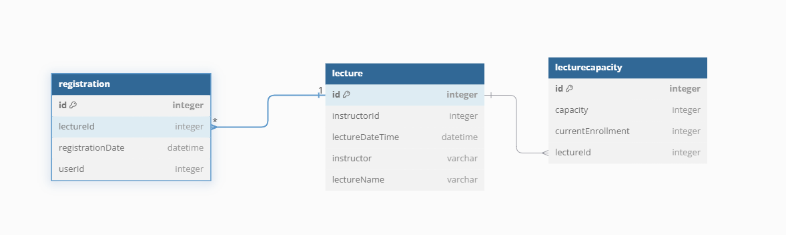

_# HH99-Week02-Architecture
[ 2주차 과제 ] TDD & 클린아키텍처

## 🔥 TODO
### **`Default`**
  - [X] 아키텍처 준수를 위한 애플리케이션 패키지 설계
  - [X] 특강 도메인 테이블 설계 및 목록/신청 등 기본 기능 구현
  - [X] 각 기능에 대한 **단위 테스트** 작성
  > 사용자 회원가입/로그인 기능은 구현하지 않습니다.
### **`STEP 3`**
  - [X] 설계한 테이블에 대한 **ERD** 및 이유를 설명하는 **README** 작성
  - [X] 선착순 30명 이후의 신청자의 경우 실패하도록 개선
  - [X] 동시에 동일한 특강에 대해 40명이 신청했을 때, 30명만 성공하는 것을 검증하는 **통합 테스트** 작성
### **`STEP 4`**
  - [X] 같은 사용자가 동일한 특강에 대해 신청 성공하지 못하도록 개선
  - [X] 동일한 유저 정보로 같은 특강을 5번 신청했을 때, 1번만 성공하는 것을 검증하는 **통합 테스트** 작성

## API Specs
1️⃣ **(핵심)** 특강 신청 **API**

- [X] 특정 userId 로 선착순으로 제공되는 특강을 신청하는 API 를 작성합니다.
- [X] 동일한 신청자는 동일한 강의에 대해서 한 번의 수강 신청만 성공할 수 있습니다.
- [X] 특강은 선착순 30명만 신청 가능합니다(특강 신청 시 신청인원 업데이트).
- [X] 이미 신청자가 30명이 초과되면 이후 신청자는 요청을 실패합니다.

2️⃣ 특강 선택 API

- [X] 날짜별로 현재 신청 가능한 특강 목록을 조회하는 API 를 작성합니다.
- [X] 특강의 정원은 30명으로 고정이며, 사용자는 각 특강에 신청하기전 목록을 조회해볼 수 있어야 합니다.

3️⃣ 특강 신청 완료 목록 조회 API

- [X] 특정 userId 로 신청 완료된 특강 목록을 조회하는 API 를 작성합니다.
- [X] 각 항목은 특강 ID 및 이름, 강연자 정보를 담고 있어야 합니다.


## 테이블 **ERD**
### 테이블 설계 중 들었던 고민
```
실제로 특강을 신청하는 서비를 만든다고 하면 좀 더 신중하게 많은 관계를 고려해서 DB설계를 했어야 했다.
하지만 과제 요구사항에 좀 더 집중해서 학생에 대한 테이블, 강사에 대한 테이블 등은 제외하고
학생 ID는 수강 신청 테이블에 강사의 기본정보는 강의 테이블에 컬럼으로 추가하였다.
또한 강의 테이블에 수강 신청이 가능한 날짜와 수강 신청 마감 일자, 수강 신청 테이블에서 수강을 신청했을 때
삭제 여부 확인하는 컬럼 등도 실제 서비스였다면 고려를 했어야 하지만 이번 과제에서는 고려하지 않기로 했다.
```

1. Lecture (강의 테이블)
    ```
   강의와 관련된 정보를 저장하는 테이블입니다.
    강의 이름, 강사, 그리고 강의가 열리는 날짜와 시간 등의 필드를 포함합니다.
    강의마다 고유한 ID(id)로 구분되며, 강사와 강의명을 매칭해 관리할 수 있습니다.
    ```
   - `id` : 강의 고유 ID로 기본 키 역할을 합니다.
   - `instructorId` : 강사의 ID로, 특정 강사를 식별하기 위한 값입니다.
   - `lectureDateTime` : 강의가 진행되는 날짜와 시간입니다.
   - `instructor` : 강사의 이름을 저장합니다.
   - `lectureName` : 강의의 이름입니다.


2. LectureCapacity (강의 수용 인원 테이블)
    ```
   각 강의의 수용 인원과 현재 등록된 인원 수를 관리하는 테이블입니다. 
   lectureId는 해당 강의와 연결되며, 이를 통해 해당 강의가 최대 몇 명을 수용할 수 있고, 
   현재 몇 명이 등록되어 있는지 확인할 수 있습니다.
    ```
   - `id` : 수용 인원 테이블의 고유 ID로 기본 키 역할을 합니다.
   - `capacity` : 강의가 수용할 수 있는 최대 인원 수를 저장합니다.
   - `currentEnrollment` : 현재 등록된 학생의 수를 저장합니다.
   - `lectureId` : 강의와 연결된 ID로, lecture 테이블의 id와 외래 키 관계를 맺습니다. 
 

3. Registration (수강 신청 테이블)
    ```
   수강 신청 정보를 저장하는 테이블입니다. 
   사용자가 어떤 강의에 신청했는지, 신청 날짜는 언제인지를 관리합니다. 
   lectureId를 통해 lecture 테이블과 연결되며, 사용자와 강의의 관계를 관리할 수 있습니다.
   ```
   - `id` : 수강 신청의 고유 ID로 기본 키 역할을 합니다.
   - `lectureId` : 수강 신청한 강의의 ID로, lecture 테이블의 id와 외래 키 관계를 맺습니다.
   - `registrationDate` : 수강 신청이 이루어진 날짜 및 시간을 저장합니다.
   - `userId` : 수강 신청한 사용자의 ID입니다.


### 테이블 간 관계
1. LectureCapacity와 Lecture의 관계

```
하나의 강의(lecture)는 하나의 수용 인원 정보를 가질 수 있습니다(lecturecapacity).
lecturecapacity 테이블의 lectureId는 lecture 테이블의 id를 참조하는 외래 키입니다.
즉, LectureCapacity → Lecture는 일대일 관계입니다.
LectureCapacity의 컬럼들이 Lecture 테이블에 포함되어도 큰 문제는 없겠지만.
동시성 문제를 고려했을 때 수용 인원에 대한 정보는 분리하는게 맞다고 판단하였습니다.
```

2. Registration과 Lecture의 관계
```
하나의 강의에는 여러 명의 수강생이 등록할 수 있으며, 한 수강생은 여러 강의에 신청할 수 있습니다.
registration 테이블의 lectureId는 lecture 테이블의 id를 참조하는 외래 키입니다.
즉, Registration → Lecture는 다대일 관계(many-to-one)입니다.
```
